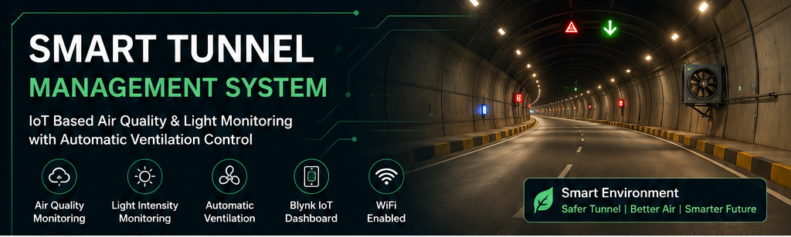
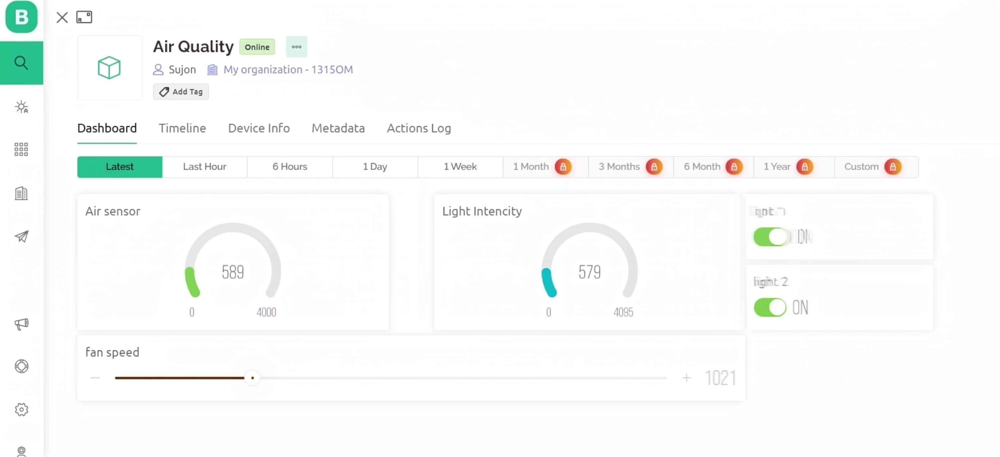

<div align="center">



# 🚇 Smart Tunnel Management System

### IoT-Based Air Quality & Light Monitoring with Automatic Ventilation Control

[](#)
[](#)
[](#)

</div>

---

## 📌 About the Project

The **Smart Tunnel Management System** is an ESP32-based IoT prototype designed to monitor environmental conditions inside a tunnel and control ventilation according to air-quality conditions.

### Core hardware

- **ESP32** — main controller and Wi-Fi
- **MQ2** — air-quality/gas sensing in the current firmware
- **BH1750** — light-intensity sensing
- **L298N** — DC motor/fan driver
- **DC fan** — ventilation actuator
- **Blynk** — remote monitoring and manual control

> **Implementation note:** The current firmware uses **MQ2**. The supplied Proteus circuit contains an **MQ135/ESP32-CAM representation**, so the circuit image and firmware should be treated as two documentation views unless those components are implemented in separate firmware.

---

## ✨ Features

- 🌫️ Real-time air-quality/gas monitoring
- 💡 Light-intensity monitoring
- 🌀 Automatic fan control based on air-quality level
- 🎛️ Manual fan-speed control through Blynk
- 📱 Blynk IoT dashboard
- 📡 Wi-Fi communication
- 🚨 Pollution alert
- 💡 Low-light alert
- ⚡ L298N motor-driver control

---

## 🏗️ System Architecture

```text
 MQ2 ──────────────┐
                   │
 BH1750 ───────────┼──► ESP32 ──► Air Quality Decision ──► L298N ──► DC Fan
                   │      │
                   │      └──────── Wi-Fi ──► Blynk Cloud ──► Blynk Dashboard
```

---

## 🔌 Circuit Diagram

<div align="center">


</div>

### Main firmware connections

| Component | Connection |
|---|---|
| MQ2 AO | ESP32 GPIO34 |
| BH1750 SDA | ESP32 default I²C SDA |
| BH1750 SCL | ESP32 default I²C SCL |
| L298N ENA | ESP32 GPIO15 |
| L298N IN1 | ESP32 GPIO2 |
| L298N IN2 | Not connected in current firmware |
| L298N OUT1/OUT2 | DC fan |
| ESP32 GND | Common ground |

---

## 📱 Blynk Dashboard
<div align="center">



</div>

### Virtual pins

| Pin | Function | Direction |
|---|---|---|
| **V0** | MQ2 raw ADC value | ESP32 → Blynk |
| **V1** | Auto / Manual mode | Blynk → ESP32 |
| **V2** | BH1750 light level | ESP32 → Blynk |
| **V3** | Current fan PWM | ESP32 → Blynk |
| **V4** | Manual fan PWM | Blynk → ESP32 |

---

## 🌀 Automatic Fan Control

The current firmware uses these **raw MQ2 ADC thresholds**:

| MQ2 ADC | Fan State | PWM |
|---:|---|---:|
| 0–490 | OFF | 0 |
| 491–900 | LOW | 90 |
| 901–1500 | MEDIUM | 170 |
| >1500 | HIGH | 255 |

```text
MQ2 Reading
     │
     ▼
ESP32
     │
     ├── ≤ 490 ──────► FAN OFF
     │
     ├── 491–900 ────► LOW
     │
     ├── 901–1500 ───► MEDIUM
     │
     └── > 1500 ─────► HIGH
```

> These are raw ADC thresholds from the current firmware. They are **not standardized ppm or AQI values** and should be calibrated for the actual sensor and tunnel environment.

---

## 🎛️ Blynk Operating Modes

### Automatic

```text
V1 = 1
     ↓
MQ2 → ESP32 → Threshold Decision → PWM → L298N → Fan
```

### Manual

```text
V1 = 0
     ↓
V4 (0–255) → ESP32 → GPIO15 PWM → L298N → Fan
```

---

## 🔔 Blynk Events

The current firmware uses these event codes:

```text
polution_alert
lightdamage
```

Create the same event codes in your Blynk template.

---

## 💻 Firmware Setup

Open:

```text
firmware/Smart_Tunnel_ESP32/Smart_Tunnel_ESP32.ino
```

Configure:

```cpp
#define BLYNK_TEMPLATE_ID "YOUR_TEMPLATE_ID"
#define BLYNK_TEMPLATE_NAME "YOUR_TEMPLATE_NAME"
#define BLYNK_AUTH_TOKEN "YOUR_AUTH_TOKEN"

char ssid[] = "YOUR_WIFI_NAME";
char pass[] = "YOUR_WIFI_PASSWORD";
```

Install:

- Blynk library
- BH1750 library
- ESP32 board package

---

## 📂 Repository Structure

```text
Smart-Tunnel-Management-System/
│
├── README.md
│
├── firmware/
│   └── Smart_Tunnel_ESP32/
│       └── Smart_Tunnel_ESP32.ino
│
├── hardware/
│   └── circuit diagram.jpg
│
├── documentation/
│   └── Smart_Tunnel_IoT_Full_Documentation.docx
│
└── images/
    ├── banner.png
    ├── BLYNK.png
    └── Project details.jpg
    
```

---

## 🔐 Security

Never commit real credentials to a public GitHub repository.

Keep these private:

```text
Wi-Fi password
Blynk Auth Token
secrets.h
credentials.h
```

---

## 📚 Documentation

- [User Manual](documentation/Smart_Tunnel_IoT_Full_Documentation.docx)


---

<div align="center">

### 🚇 Smarter Monitoring • Safer Ventilation • Connected Infrastructure

</div>
